# install arduino IDE
- follow this link
https://support.arduino.cc/hc/en-us/articles/360019833020-Download-and-install-Arduino-IDE

# install ESP32 Add-on in Arduino IDE
- In your Arduino IDE, go to File> Preferences
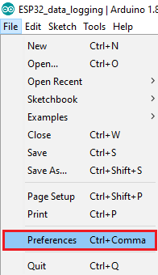
- Enter the following into the “Additional Board Manager URLs” field: "https://espressif.github.io/arduino-esp32/package_esp32_index.json"
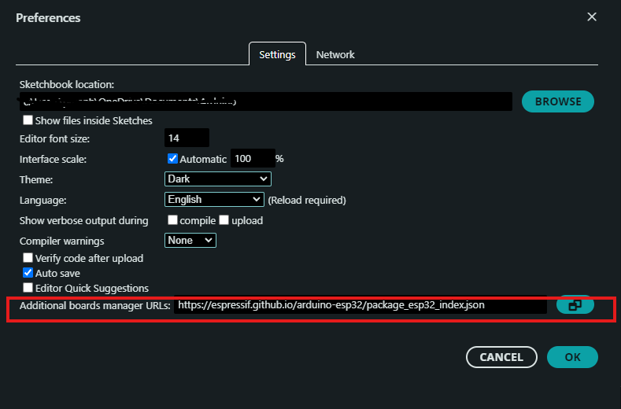
- Open the Boards Manager. You can go to Tools > Board > Boards Manager… or you can simply click the Boards Manager icon in the left-side corner.
- Search for ESP32 and press the install button for esp32 by Espressif Systems.
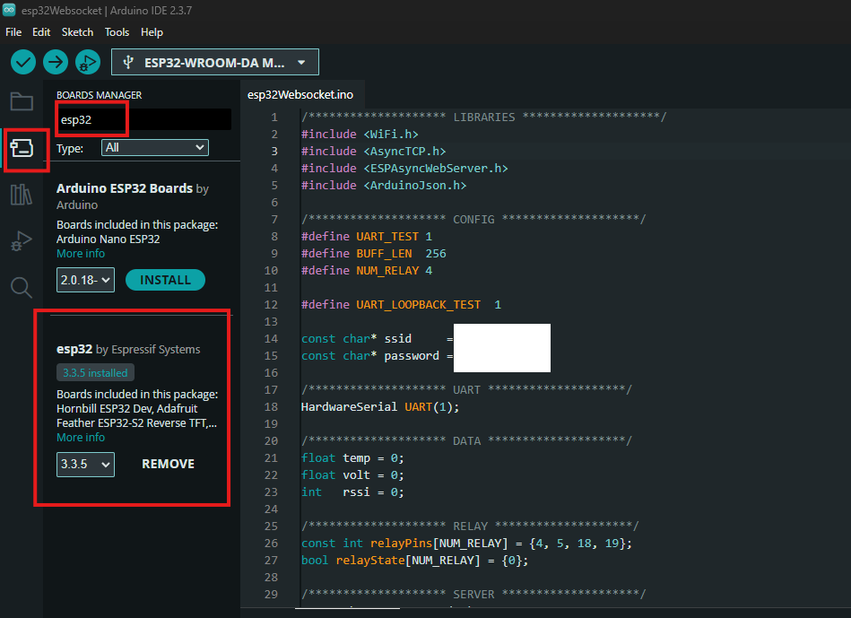

# install dependence libs
- Open the Library Manger, search for ESPAsyncWebServer and install the ESPAsyncWebServer by ESP32Async.
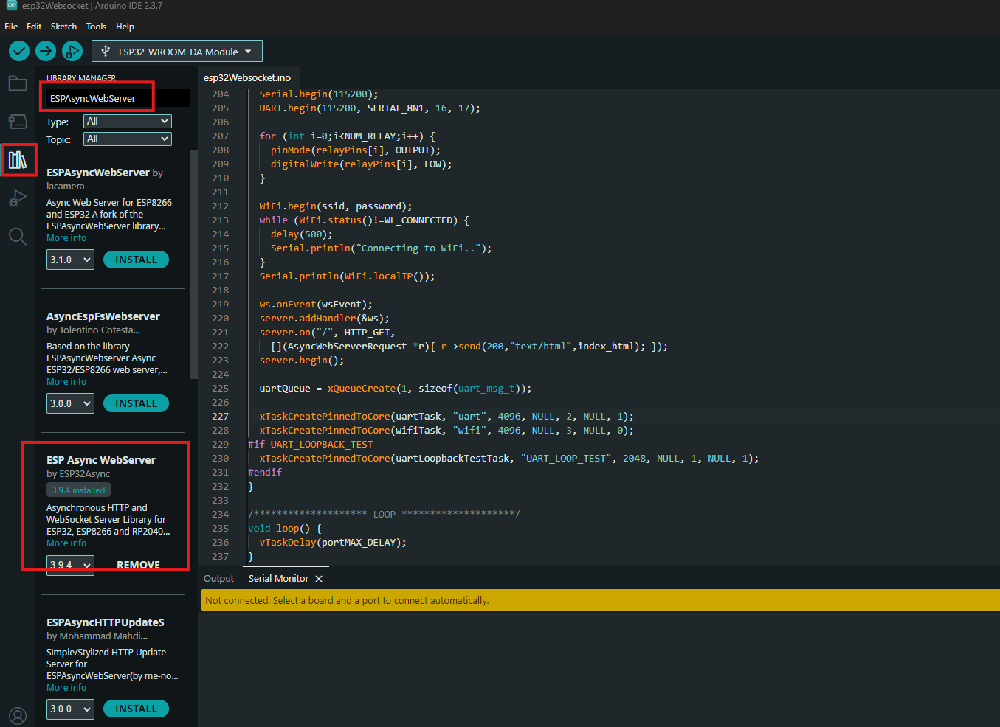

- Then, install the AsyncTCP library. Search for AsyncTCP and install the AsyncTCP by ESP32Async.
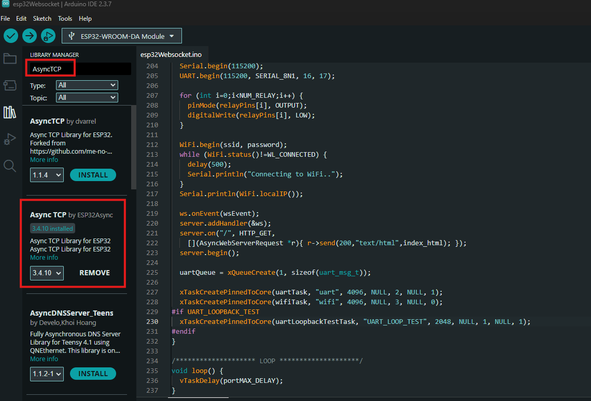

- Lately, install ArduinoJson library. Search for ArduinoJson and install the ArduinoJson by Benoit.
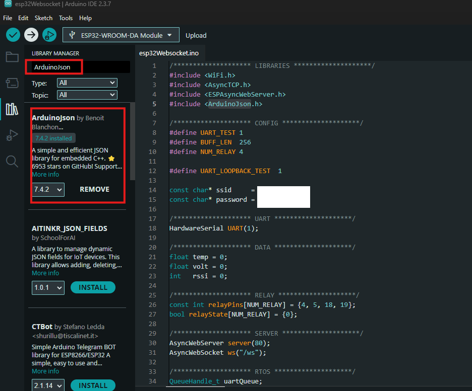

# connect with esp32 board
- Plug the ESP32 board to your computer. With your Arduino IDE open, follow these steps:
    1. Connect esp32 board with PC
    2. Select your Board in Tools > Board menu (in my case it’s the ESP32 WROOM DA MODULE)
    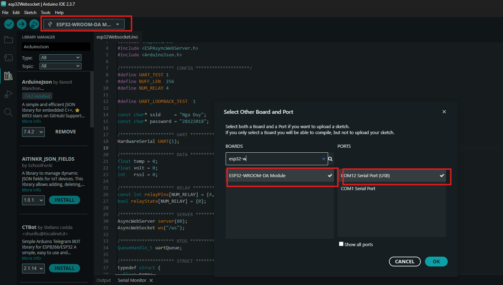
    3. Go to File> Open and select file esp32Websocket.ino
    4. Change const char* ssid = "REPLACE_WITH_YOUR_SSID" and const char* password = "REPLACE_WITH_YOUR_PASSWORD"; in file esp32Websocket.inoto your Wifi's SSID and password
    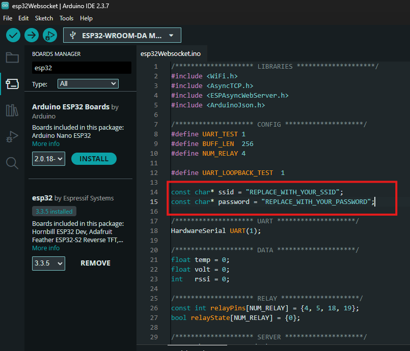
    5. Press the Upload button in the Arduino IDE. Wait a few seconds while the code compiles and uploads to your board.
    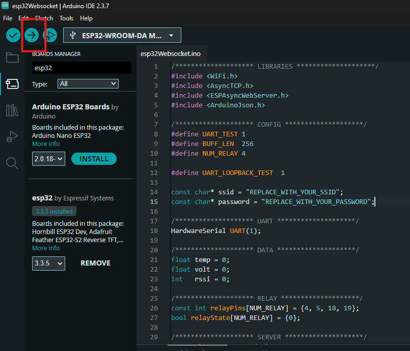

# Troubleshooting
- If you try to upload a new sketch to your ESP32 and you get this error message “A fatal error occurred: Failed to connect to ESP32: Timed out… Connecting…“. It means that your ESP32 is not in flashing/uploading mode. Having the right board name and COM port selected, follow these steps:
    1. Hold-down the “BOOT” button in your ESP32 board.
    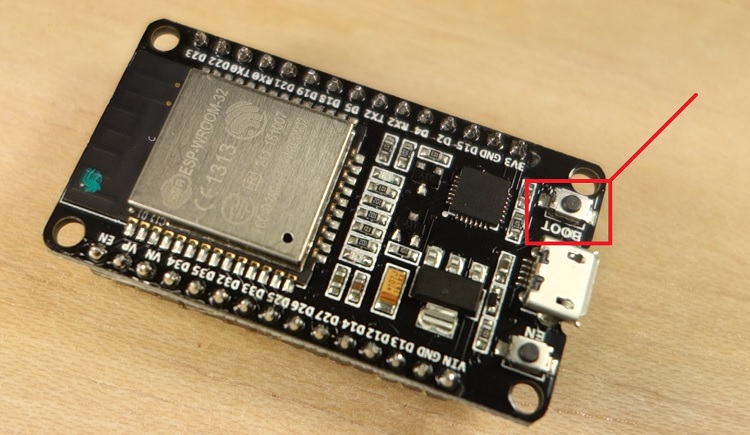
    2. Press the “Upload” button in the Arduino IDE to upload your sketch.
    3. After you see the  “Connecting….” message in your Arduino IDE, release the finger from the “BOOT” button:
    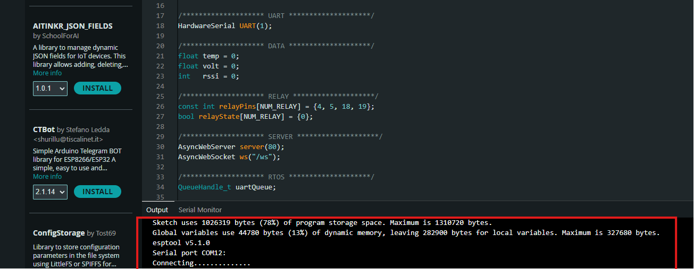
    4. After that, you should see the “Done uploading” message.
    

# Connect with serial
- Click the Serial Monitor icon in the top-right corner and set the baud rate to 115200.
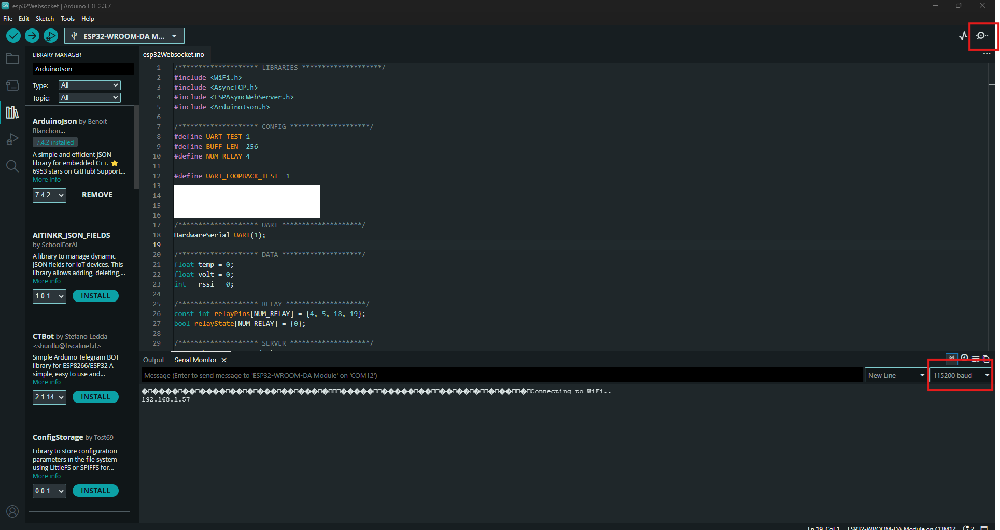
- You will see the ip of esp32 (in my case it's 192.168.1.57)
- Open a web browser and enter the ESP32 IP address. You will see parameters received from UART, and you can configure relay 1 to 4.
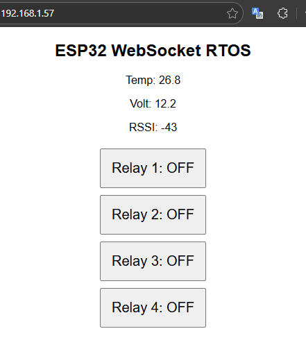
- You can toggle buttons on the WebSocket interface (to change their state) and check the GPIO pin states in the Serial Monitor.
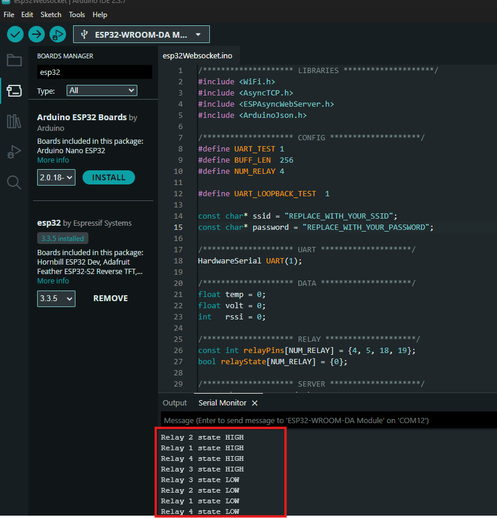
- You can change the UART_LOOPBACK_TEST flag in the source code to enable UART loopback testing. Random data will be sent from UART TX to UART RX, so you need to connect the UART TX pin (D17) to the UART RX pin (D16). After that, check the UART parameters on the web interface.
